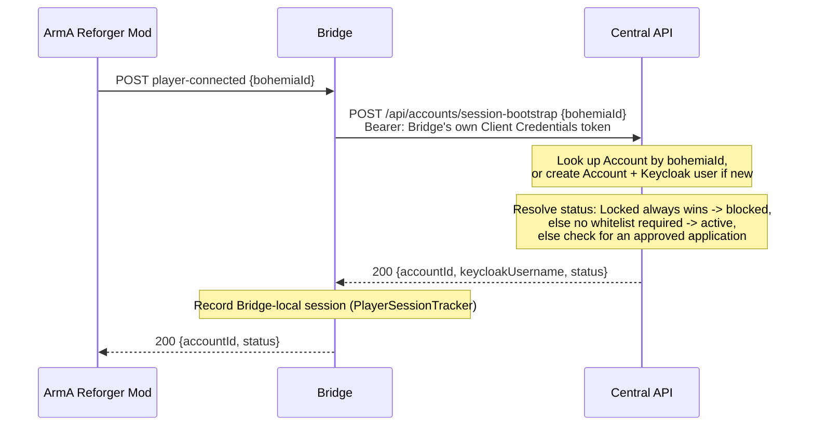

# Login & Session Bootstrap

`POST player-connected {bohemiaId}` is the first thing that happens when a player connects to the
gameserver — it resolves (or provisions) that player's account via the Central API and starts a
Bridge-local session for them.

## Sequence

## Account creation on first contact

If no `Account` exists yet for the given `bohemiaId`, Core creates one — `Active` by default — and
provisions a matching Keycloak user via Keycloak's admin API, with no password or credentials set.

## The three `status` values

Core resolves `status` in a fixed order, and returns exactly one of three strings:

| `status` | When |
|---|---|
| `blocked` | The account is `Locked` — this always wins, even over an approved whitelist application. |
| `active` | Not locked, and either the calling gameserver doesn't require whitelisting, or it does and this account has an `Approved` application for it. |
| `not_whitelisted` | Not locked, the gameserver requires whitelisting, and this account has no `Approved` application for it. |

`status` is purely informational for the mod to act on (e.g. to tell the player why they can't
play yet) — it doesn't gate anything else the Bridge does; a session is tracked regardless (see
below).

## Why a session is still tracked for a blocked or not-yet-whitelisted player

`player-connected` records the Bridge-local session (`PlayerSessionTracker`, in-memory, keyed by
`bohemiaId`) unconditionally — even when `status` isn't `active`. Session tracking means "this
Bohemia ID is currently connected and maps to this `AccountId`." That distinction matters
concretely: `submit-whitelist-application` needs to resolve a not-yet-whitelisted player's
`AccountId` to file their application in the first place, and it can only do that if a session
already exists for them.

## What ends the session

The counterpart to this page is disconnect: `player-disconnected` ends the Bridge's local record
of the connection, and ends whatever character session was last selected. See
[Workflows](index.md) for a short summary of that and the other two Bridge-mediated interactions.
