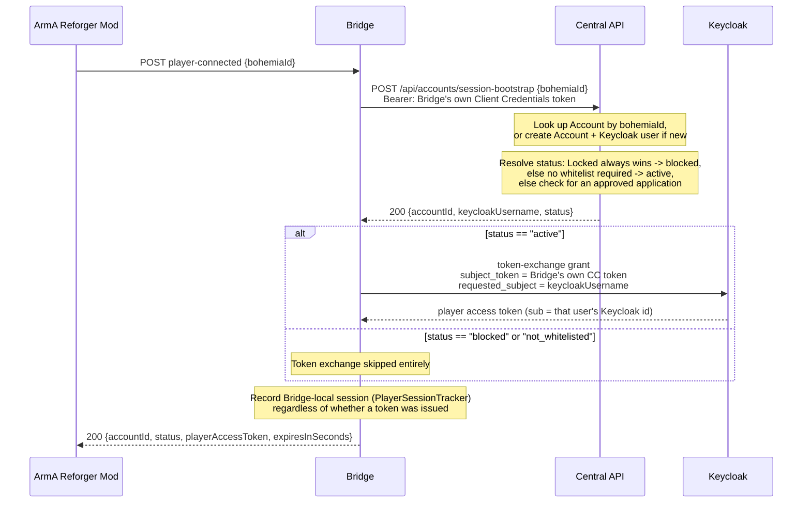

# Login & Session Bootstrap

`POST player-connected {bohemiaId}` is the first thing that happens when a player connects to the
gameserver — a single call from the mod's perspective, but it drives two separate token operations
across three components.

## Sequence

## Why the token exchange goes Bridge → Keycloak, never through Core

Keycloak requires the client authenticating a token-exchange call to be the *same* client the
subject token was issued to. Core cannot perform this exchange on the Bridge's behalf without
holding the Bridge's own client secret — which would defeat the whole point of giving each
gameserver instance its own, independently revocable OAuth client. So the two components have a
strict division of labor: Core's `session-bootstrap` only ensures the Account and its Keycloak user
exist and reports back *which* Keycloak username to request; the Bridge itself then calls
Keycloak's token endpoint directly, authenticated with its own client credentials, requesting
`requested_subject=<keycloakUsername>`. See `eliferpg-core`'s `ARCHITECTURE.md` §4.3 for the
verified mechanics behind this (tested directly against a live Keycloak instance).

## Account creation on first contact

If no `Account` exists yet for the given `bohemiaId`, Core creates one — `Active` by default — and
provisions a matching Keycloak user via Keycloak's admin API, with no password or credentials set.
That's intentional: this account is only ever reached through the Bridge's impersonation-based
token exchange, never a normal username/password Keycloak login.

## The three `status` values

Core resolves `status` in a fixed order, and returns exactly one of three strings:

| `status` | When |
|---|---|
| `blocked` | The account is `Locked` — this always wins, even over an approved whitelist application. |
| `active` | Not locked, and either the calling gameserver doesn't require whitelisting, or it does and this account has an `Approved` application for it. |
| `not_whitelisted` | Not locked, the gameserver requires whitelisting, and this account has no `Approved` application for it. |

Only an `active` status leads to a token exchange. `blocked` and `not_whitelisted` both return
`200` with `playerAccessToken: null` — never a `4xx` — so the mod always gets a well-formed
response to display to the player.

## Why a session is still tracked without a token

`player-connected` records the Bridge-local session (`PlayerSessionTracker`, in-memory, keyed by
`bohemiaId`) unconditionally — even when `status` isn't `active` and no token was issued. Session
tracking means "this Bohemia ID is currently connected and maps to this `AccountId`," not "has a
live token." That distinction matters concretely: `submit-whitelist-application` needs to resolve a
not-yet-whitelisted player's `AccountId` to file their application in the first place, and it can
only do that if a session already exists for them.

## Locking doesn't rely on Keycloak's `enabled` flag

Locking an account (`POST /api/accounts/{id}/lock`) disables its Keycloak user too, as ordinary
account hygiene. But that disable is not what actually stops a blocked player from getting a new
token — verified against a live Keycloak instance, an impersonation-based token-exchange grant for
a disabled user still succeeds. The real enforcement point is `BridgeTokenProvider`'s own
`ExchangeForPlayerTokenAsync`: it checks `status != "active"` and skips calling Keycloak entirely in
that case, structurally, as part of the one method that mints player tokens — not something every
caller has to remember to check independently. A token already issued before a lock remains valid
until it naturally expires (the realm's access-token lifespan is ~5 minutes).

## What ends the session

The counterpart to this page is disconnect: `player-disconnected` revokes the issued token
immediately by its `jti` rather than waiting out that TTL, and ends whatever character session was
last selected. See [Workflows](index.md) for a short summary of that and the other two
Bridge-mediated interactions — full treatment is planned as a follow-up page.
